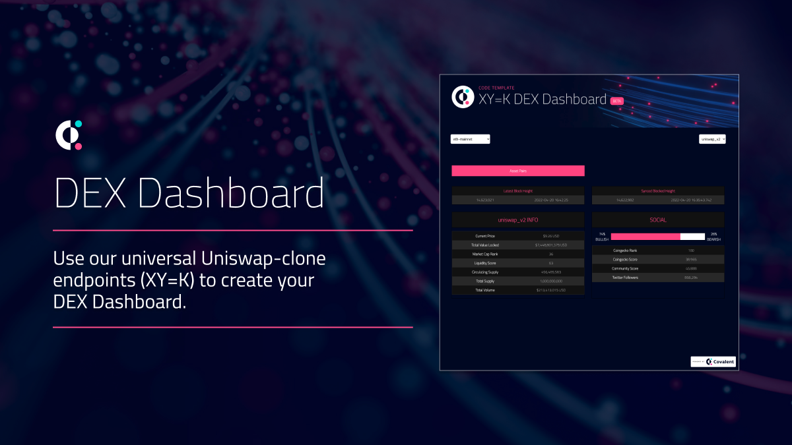
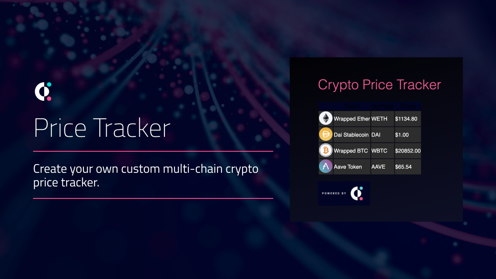
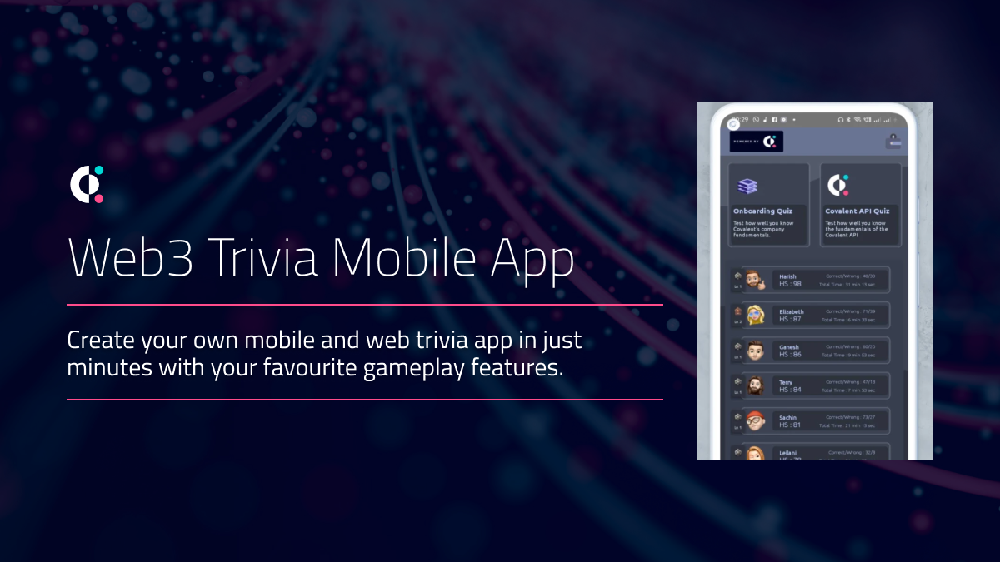
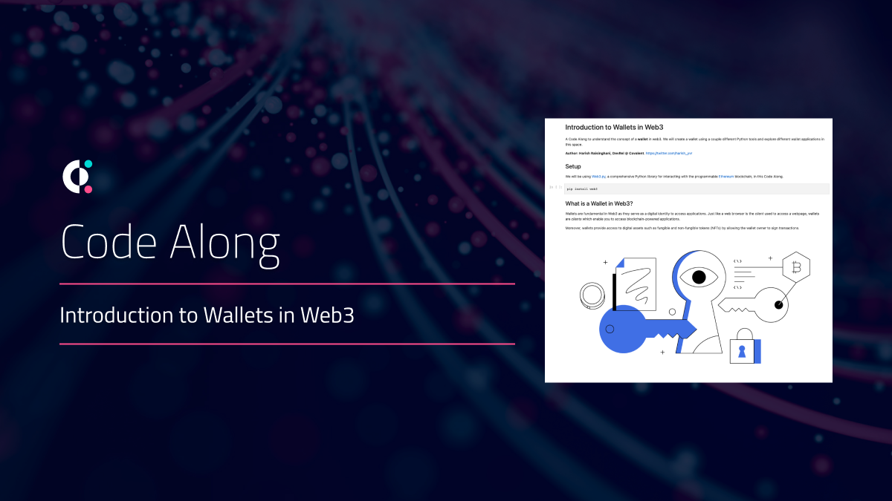
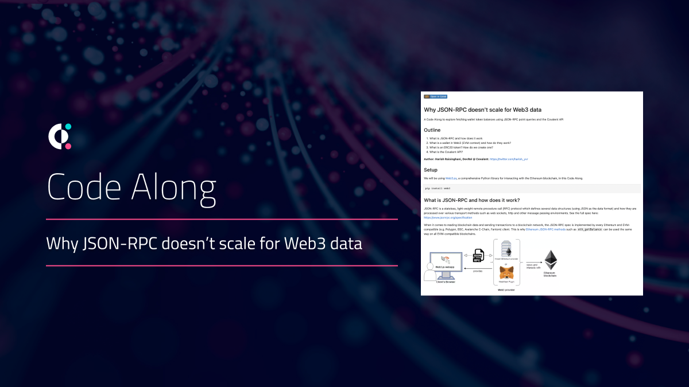
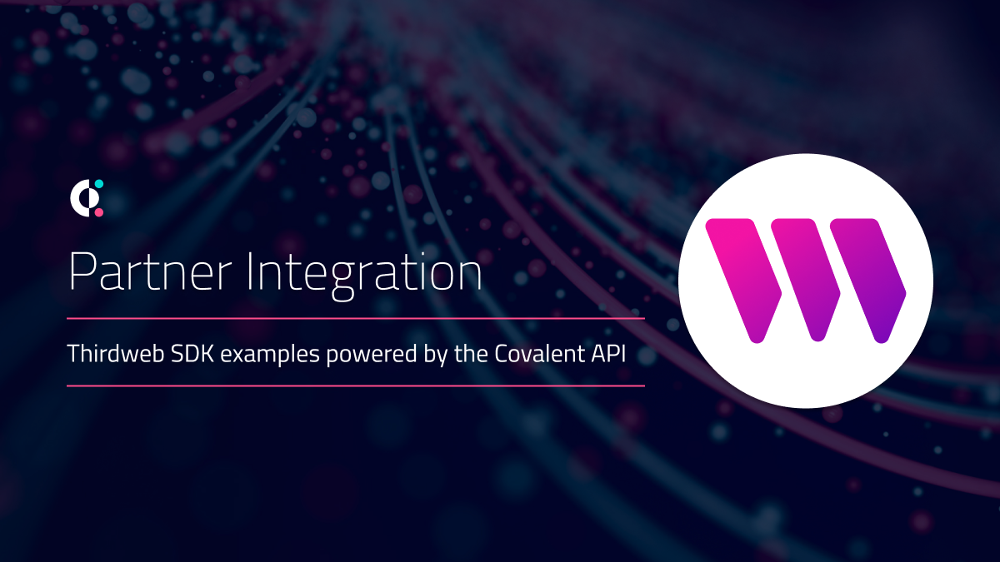

# Web3 Starter Resources
Build your multi-chain web3 apps using our ready-to-ship resources!

All resources use the **Covalent Unified API** to pull on-chain data seamlessly from all [supported blockchains](https://www.covalenthq.com/docs/networks/). 

&nbsp;
## Quick Start

Fork this repo to get started. 

- [App Templates](#web3-app-templates) - ready-to-use templates for common web3 use cases
- [Components Library](#web3-components-library) - plug & play styled web3 React components
- [Code Alongs](#web3-code-alongs) - extend your web3 knowledge with these guided Python notebooks
- [Partner Resources](#web3-partners) - templates and other developer resources developed by our web3 partners

&nbsp;
## Give this repo some :star: power!
If these resources help you onboard into web3 and #BUIDL faster, please star this repo! :star:

&nbsp;
## Feedback & Support
We love our community and want to help *everyone* build in web3 :muscle:

If you:
- Find bugs or issues with any of the resources, please raise an [Issue](https://github.com/covalenthq/web3-templates/issues). Better yet, identify a fix and create a [PR](https://github.com/covalenthq/web3-resources/pulls) :smile:
- Need any support with using any of the templates, message us in our [Discord](https://covalenthq.com/discord) in the #feedback-and-support channel

&nbsp;
## Web3 App Templates

| [XY=K DEX Dashboard](https://github.com/covalenthq/dex-dashboard-template) |[Price Tracker Chrome Extension](https://github.com/covalenthq/price-tracker-chrome-extension)
| :-----------: | :-----------: |
|  |  |
|[**Web3 Trivia Mobile App**](https://github.com/covalenthq/web3-trivia-template) | |
|  | |

&nbsp;
## Web3 Components Library
The [web3 components library](./components/) in (`/components`) is powered by the Covalent Unified API and consists of useful React components to fetch any on-chain data across any Covalent supported blockchain networks.

&nbsp;
## Web3 Code Alongs
Use these 'Code Along' notebooks to extend your web3 knowledge. Open up these notebooks using [Jupyter](https://jupyter.org/), [Google Colab](https://colab.research.google.com/) or your favourite IPython environment. 

|[Intro to Wallets in Web3](./code-alongs/Introduction_to_Wallets_in_Web3.ipynb) | [Why JSON-RPC doesn't scale](./code-alongs/Why_JSON_RPC_doesn't_scale_for_Web3_data.ipynb) |
| :-----------: | :-----------: |
||  |

&nbsp;
## Web3 Partners
Check out these resources developed with our web3 partners:

|[Thirdweb SDK](https://github.com/thirdweb-example/covalent/?utm_source=covalent&utm_medium=web3-resources) | |
| :-----------: | :-----------: |
|| |

