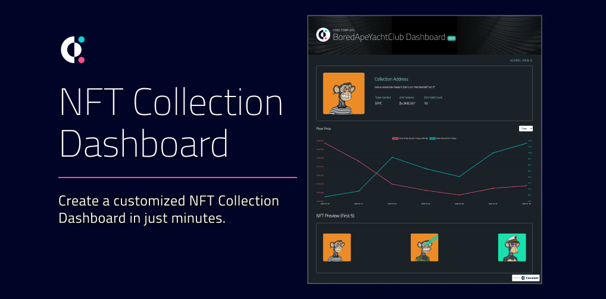

# Web3 Starter Templates
Build your multi-chain Web3 dapps using our ready-to-ship templates!

All templates use the Covalent API to pull on-chain data seamlessly from [supported blockchains](https://www.covalenthq.com/docs/networks/). 

&nbsp;
## Give this repo some :star: power!
If these templates help you onboard into Web3 and #BUIDL faster, please star this repo! :star:

&nbsp;
## Feedback & Support
We love our community and want to help *everyone* build in Web3 :muscle:

If you:
- Find bugs or issues with any of the templates, please raise an [Issue](https://github.com/covalenthq/web3-templates/issues). Better yet, identify a fix and create a [PR](https://github.com/covalenthq/web3-templates/pulls) :smile:
- Need any support with using any of the templates, message us in our [Discord](https://covalenthq.com/discord) in the #feedback-and-support channel

&nbsp;
## Templates

| [NFT Collection Dashboard](https://github.com/covalenthq/nft-dashboard-template)| [XY=K DEX Dashboard](https://github.com/covalenthq/dex-dashboard-template) |
| :-----------: | :-----------: |
|  |  |

