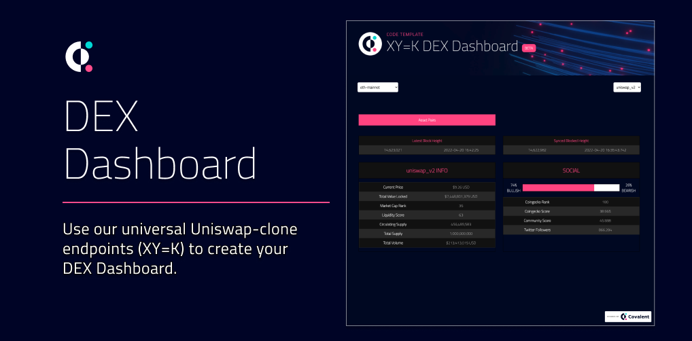
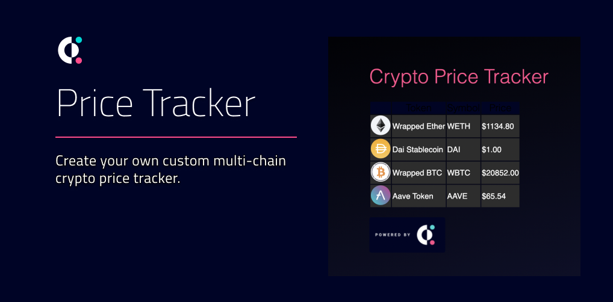
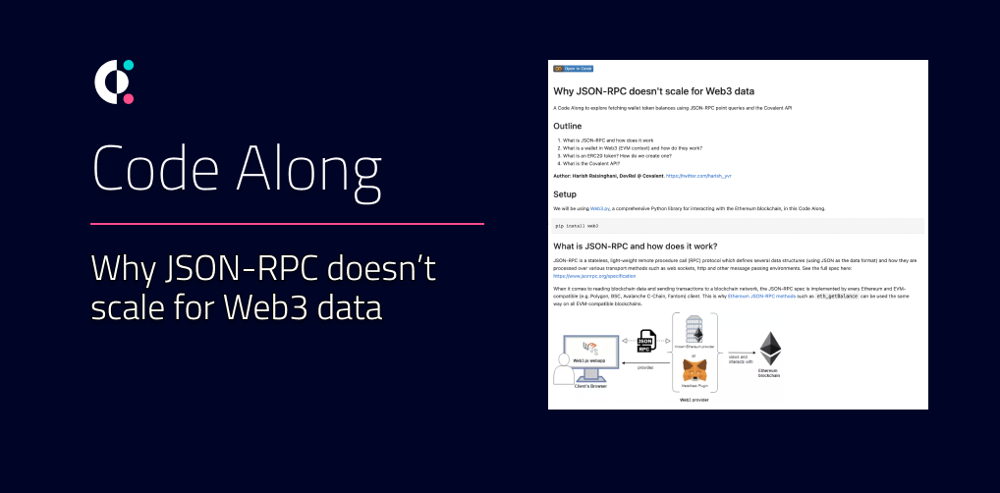

# Web3 Starter Resources
Build your multi-chain web3 apps using our ready-to-ship resources!

All resources use the Covalent API to pull on-chain data seamlessly from [supported blockchains](https://www.covalenthq.com/docs/networks/). 

&nbsp;
## Give this repo some :star: power!
If these resources help you onboard into web3 and #BUIDL faster, please star this repo! :star:

&nbsp;
## Feedback & Support
We love our community and want to help *everyone* build in web3 :muscle:

If you:
- Find bugs or issues with any of the resources, please raise an [Issue](https://github.com/covalenthq/web3-templates/issues). Better yet, identify a fix and create a [PR](https://github.com/covalenthq/web3-resources/pulls) :smile:
- Need any support with using any of the templates, message us in our [Discord](https://covalenthq.com/discord) in the #feedback-and-support channel

&nbsp;
## Web3 App Templates

| [XY=K DEX Dashboard](https://github.com/covalenthq/dex-dashboard-template) |[Price Tracker Chrome Extension](https://github.com/covalenthq/price-tracker-chrome-extension)
| :-----------: | :-----------: |
|  |  |

&nbsp;
## Web3 Components Library
https://github.com/covalenthq/web3-components

This web3 library is powered by the Covalent Unified API and consists of useful React components to fetch any on-chain data across any Covalent supported blockchain networks.

&nbsp;
## Web3 Code Alongs

|[Why JSON-RPC doesn't scale](./code-alongs/Why_JSON_RPC_doesn't_scale_for_Web3_data.ipynb) | |
| :-----------: | :-----------: |
|| |
